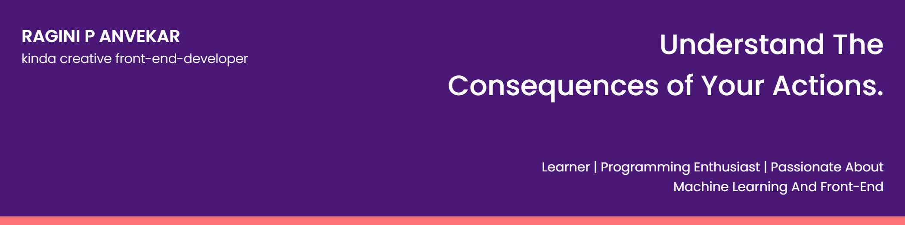

# ragpanv

## 😉 About Me

- 🔭 I’m currently working on Flutter App.

- 🌱 I’m currently learning **React, Firebase and ML**
 
- You can check out my projects right **[here](https://github.com/ragpanv)**.

- 💬 Ask me about **React, Web Development and Android**

- 📫 Contact me **[here](raginianvekar@gmail.com)**

## ✍ My Work

Here are some of my projects on Github that I am proud of:

## 📚 My Skills

## 🤝 Connect

